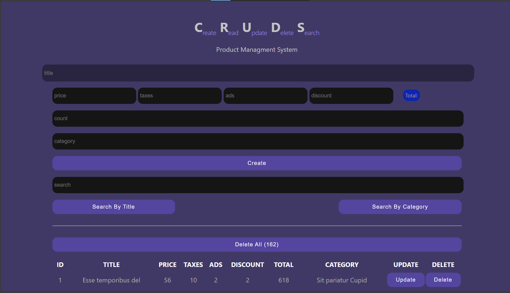

# 🛒 CRUDS

A simple CRUD application built with **HTML**, **CSS**, and **JavaScript** that allows users to manage products efficiently.

## 🚀 Features

- ➕ Create new products
- 📖 Read and display products
- ✏️ Update existing products
- ❌ Delete individual products
- 🗑️ Delete all products
- 🔍 Search products by:
  - Title
  - Category
- 💰 Automatically calculate total price based on:
  - Price
  - Taxes
  - Ads
  - Discount
- 💾 Data is stored using **Local Storage**

---

## 🛠️ Technologies Used

- HTML5
- CSS3
- JavaScript (ES6)
- Local Storage API

---

## 📂 Project Structure

```
CRUDS/
│
├── CRUDS.html
├── css/
│   └── CRUDS.css
└── js/
    └── CRUDS.js
```

---

## 📸 Screenshots
 
---

## 📖 What I Learned

Through this project I practiced:

- CRUD operations
- DOM Manipulation
- Event Handling
- Arrays & Objects
- Local Storage
- Dynamic UI Updates
- JavaScript Functions
- Input Validation
- Clean Code Organization

---

## 🌐 Live Demo


---

## 👨‍💻 Author

**Tarek Khalaf**


---

## 📄 License

This project is open source and available under the MIT License.
